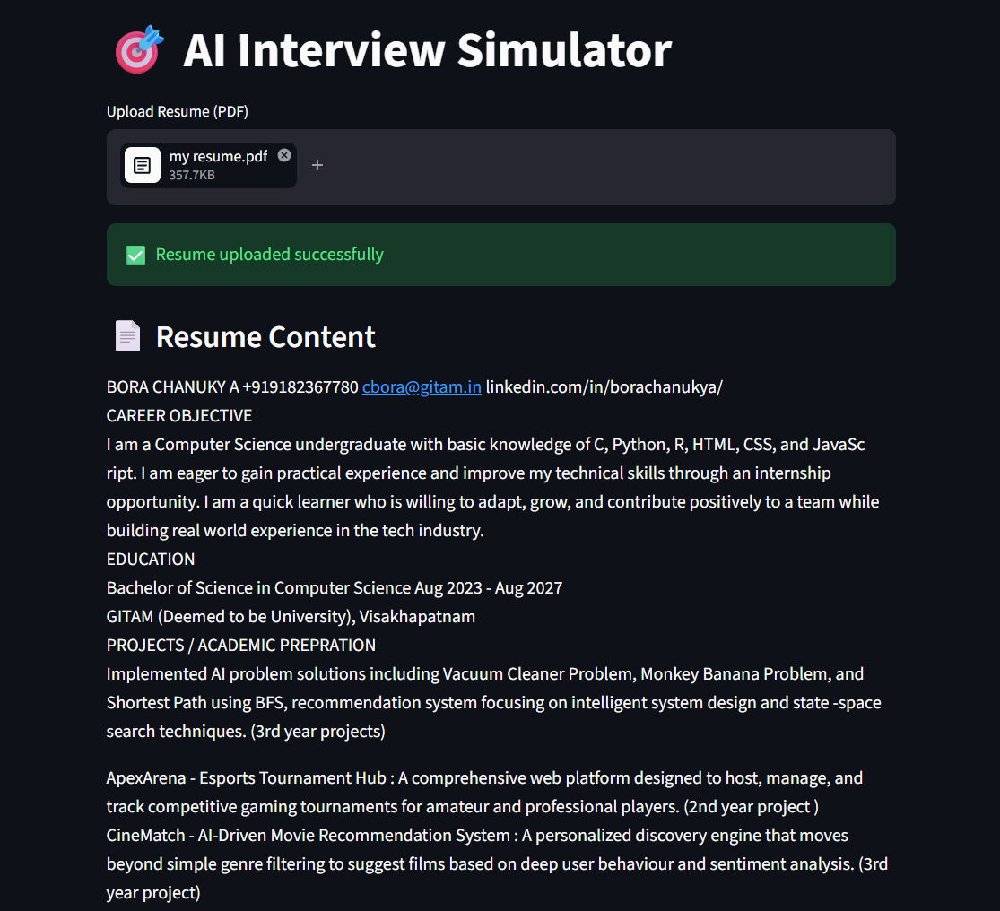
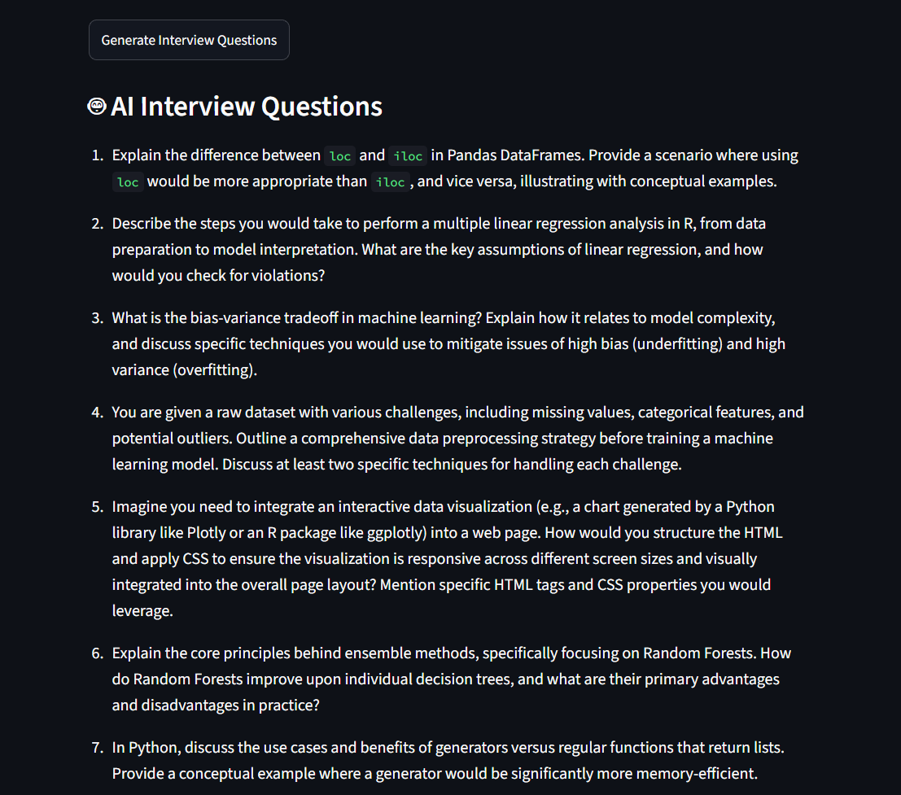
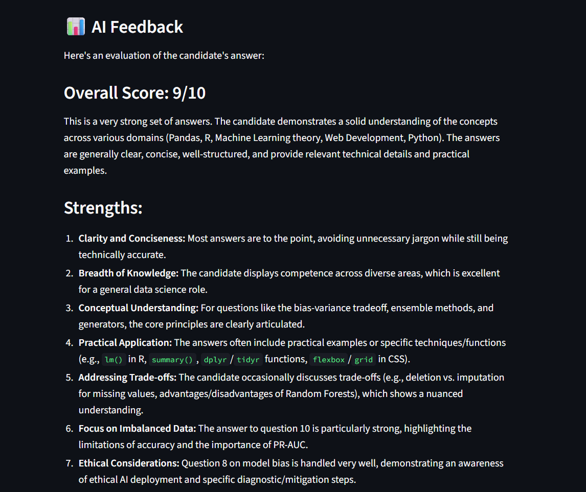

# AI Interview Simulator

An AI-powered interview preparation platform built using Streamlit and Google Gemini AI.

## Features

- Resume-based interview questions
- AI answer evaluation
- PDF resume upload
- Gemini AI integration
- Streamlit Web Interface

## Screenshots

### Home Page



### Interview Questions



### AI Feedback



## Tech Stack

- Python
- Streamlit
- Google Gemini AI
- PyPDF2

## Run Locally

```bash
pip install -r requirements.txt
streamlit run app.py
```

## Author

Bora Chanukya